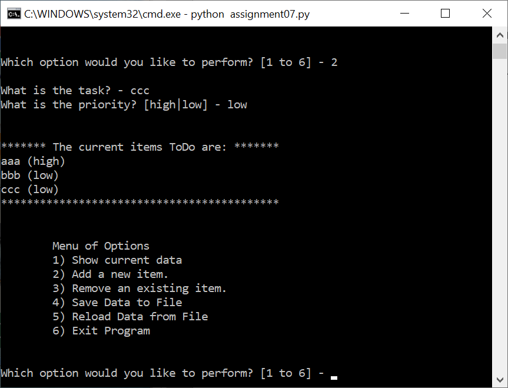
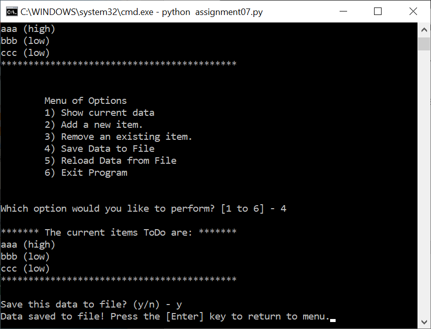
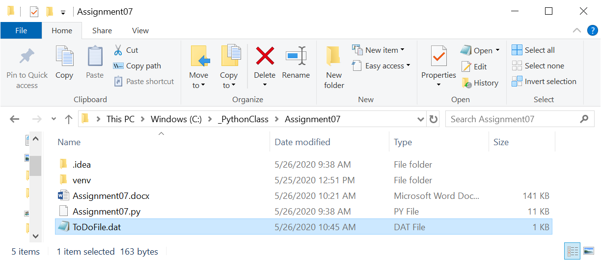
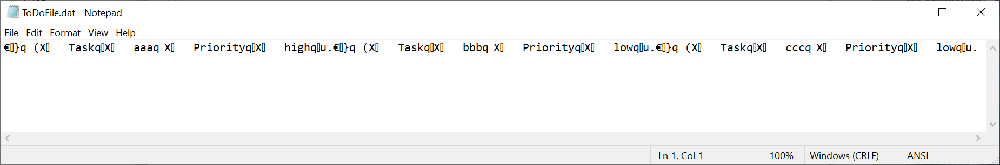
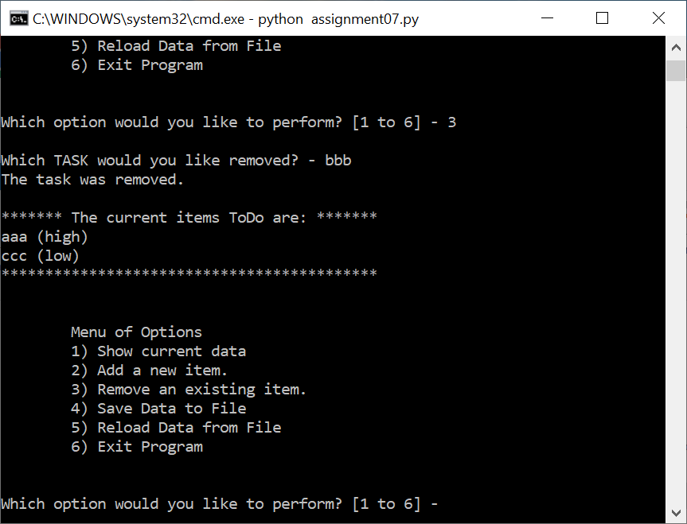
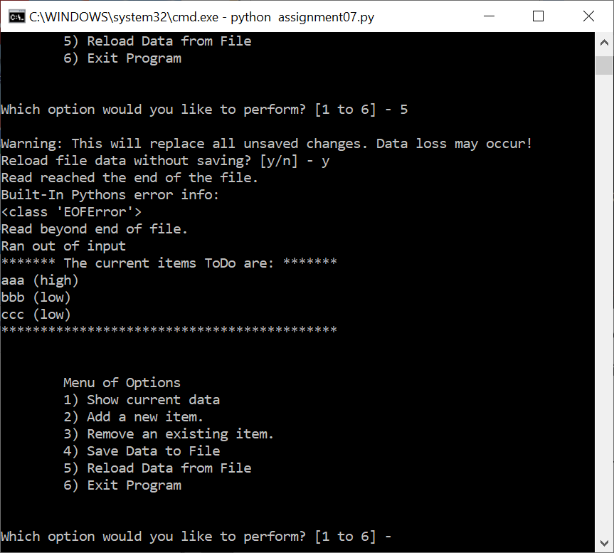

Tao Ye  
May 26, 2020  
Foundations of Programming: Python  
Assignment 07  
https://github.com/bubblecfd/IntroToProg-Python-Mod07

# Python Script Using Pickling and Error Handling

## Introduction

The objective of this assignment is the application of the so-called
"pickling" and structured error-handling techniques. To that end, I will
modify the Python script from Assignment 06 to replace the text file
\"ToDo list" with a binary file utilizing pickling functions to store
and retrieve data from files. In addition, the structured error handling
using "try -- except" is applied in the code to manage the exception
without halting the execution abruptly. With pickling, the \"ToDo list\"
file now contains the list of dictionary objects directly instead of two
columns of text data. The rest of the operation are identical to code in
the assignment 06. The script will be tested and run in both PyCharm and
a Windows command shell as a console application.

## Editing and Debugging Code in PyCharm

For this assignment, I created a new folder **C:\\\_PythonClass
\\Assignment07.** Then in PyCharm, I created a new project that uses the
**C:\\\_PythonClass\\Assignment07** folder as its location, and added
the Python script from assignment 06 and renamed to **Assigment07.py**.

For this assignment, the following changes are made.

First, at the beginning of the script, the pickling package needs to be
imported. So a line is added as below.

```
import pickle
```

Also the data file name is changed to **"ToDoFile.dat"** just to
indicate a binary file.

Then, I modified the read and write functions in the class
**FileProcessor** to operate on a binary file instead of a text file.

1.  **ReadFileDataToList** function now reads from a binary file and is very different from reading from a text file. I use **\"with\"**
    > construct, which automatically closes the file** when the code
    > reaches the end of the \"with\" block. Within the "with" block, an
    > infinite **"while"** loop is used to read one object (row of the
    > list table) a time and add the row to the list table until it
    > reaches the end of the file. A **"try-except"** construct is
    > utilized to capture the "end-of-file" error when that happens and
    > "breaks" out of the **"while"** loop to stop reading the file. The
    > binary read is done by **pickle.load()** function. When the
    > "end-of-file" exception occurs, it prints a custom error message
    > and the Python built-in error messages. A note about the return
    > value of the function: because the list table is already passed in
    > by reference, there is no need to return the list table. The
    > reference to the list table already points to the updated list
    > table.
```
@staticmethod
def ReadFileDataToList(file_name, list_of_rows):

with (open(file_name, "rb")) as objFile:
    while True:
        try:
            row = pickle.load(objFile)
            list_of_rows.append(row)
        except EOFError as e:
            print("Read reached the end of the file.")
            print("Built-In Pythons error info: ")
            print(type(e))
            print(e.__doc__)
            print(e.__str__())
            break
```
2.  **WriteListDataToFile** functions now writes the rows of the list table to a binary file. Similarly, a **"with"** construct is used
    > to automatically close the file. Within the **"with"** block, a
    > for loop saves every row of the list table to the file using
    > **pickle.dump()** function.
```
@staticmethod
def WriteListDataToFile(file_name, list_of_rows):

with open(file_name, "wb") as objFile:
    for row in list_of_rows:
        pickle.dump(row, objFile)
```
3.  **FindFile** function is not changed from assignment 06. I list it here to show that it also uses a "try-except" construct to capture
    > the "file-not-found" exception to check whether the file exists or
    > not before the read. It fulfills part of the requirement of this
    > assignment.
```
@staticmethod
def FindFile(file_name):
    try:
        file = open(file_name)
        file.close()
        return True
    except FileNotFoundError:
        return False
```

## Run the Script

### 1\. Run the script in a Windows command shell.

In the Windows shell, first change the current folder to
**C:\\\_PythonClass\\Assignment07** so the data file "ToDoFile.dat" will
be created in the desired folder. Then type in the python command to run
the script. Because only the file read and write functions are modified,
I will focus the test runs on the file read and write operations. Since
this is the very first time this script is run, the file "ToDoFile.dat"
doesn't exist yet. To add some rows in the table, option "2" is selected
several times to add the following tasks and priorities:

aaa, high

bbb, low

ccc, low

 ####
Figure 1. Script Run in Windows Shell and Option "2" Selection

At this point, the results are shown in Figure 1.

Then, option "4" is selected to save the list table to the binary file,
and the operation is shown in Figure 2.

#### 
Figure 2. Option "4" to Save Data to File

The file "ToDoFile.dat" is created in the current folder as shown in
Figure 3 and the content of the file is shown in Figure 4 which shows a
non-text content. The file should save all three tasks and we will prove
it later by reading them into the memeory.

{width="6.36in" height="2.76in"}

Figure 3. File "ToDoFile.dat" is Created

{width="7.0in" height="1.1576388888888889in"}

Figure 4. Content of the File "ToDoFile.dat"

Now let's remove task "bbb" from the list as shown in Figure 5. At this
point, there are two tasks left in the list.

{width="5.39in" height="4.12in"}

Figure 5. Remove Task "bbb" from the List

Then select option "5" to prove that the list will become the previously
saved version with all three tasks. Figure 5 shows the list now has
three tasks which demonstrates the previously write and this read
operation worked as expected. It also displayed the end-of-file
exception messages we asked the code to print when all objects in the
file are read. So the binary file read and write operate well.

{width="5.39in" height="4.85in"}

Figure 6. Reading the Binary File and Exception Messages

The run tested the modifications I made to the code with pickling and
error handling techniques.

### 2\. Run the script in PyCharm

Same operations are observed in running the code in PyCharm, and the
details are not repeated here.

## Conclusion

The assignment is to apply the pickling and structured error handling
techniques in Python code. I modified the assignment 06 code to read and
write to a binary file instead of a text file. In the file read
function, a "try-except" construct is also added to manage the
end-of-file exception that is often raised in reading a file to the end.
The test runs in both Windows shell and PyCharm showed that the pickling
and error handling techniques were applied correctly.

